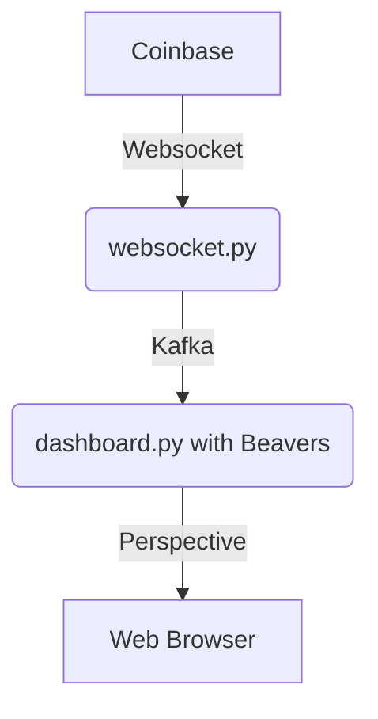

# Coinbase Market Data API Analytics

This example shows how you can leverage two powerful python libraries, [Beavers](https://github.com/tradewelltech/beavers) and [Perspective](https://github.com/finos/perspective), to analyse data in realtime and display it in a dashboard.
This tutorial assumes you are familiar with Kafka and Python and Apache Arrow.

## Architecture Overview

We will connect to Coinbase's websocket API to receive crypto market updates in real time.
In order to share this data with other services and decouple producers from consumers, we'll publish this data over [Kafka](https://kafka.apache.org/), as json.
We'll then run a [Beavers](https://github.com/tradewelltech/beavers) job that will read the data from Kafka, enrich it, and publish it in a perspective dashboard.


  
## Initial Set Up

You'll need:

- Git
- Python (at least 3.10)
- Docker to run a Kafka cluster

The code for this tutorial is available on [github](https://github.com/0x26res/beavers-examples/tree/master/01_coinbase_analytics)

### Clone the repo

```shell
git clone https://github.com/0x26res/beavers-examples
cd beavers-example/01_coinbase_analytics/
```

### Set Up the Virtual Environment

```shell
python3 -m venv --clear .venv
source ./.venv/bin/activate
pip install -r requirements.txt
```

### Set Up Kafka

We use the [kafka-kraft](https://github.com/bashj79/kafka-kraft-docker) docker image to run a super simple Kafka cluster.
To start the cluster:

```shell
docker run --name=simple_kafka -p 9092:9092 -d bashj79/kafka-kraft
```

Once started you can create a Kafka topic called `ticker`

```shell
docker exec simple_kafka /opt/kafka/bin/kafka-topics.sh \
  --create \
  --topic=ticker \
  --partitions=1 \
  --bootstrap-server=localhost:9092 \
  --replication-factor=1
```

### Publish Coinbase's Market Data on Kafka

In this step, we'll run a simple python job that listen to Coinbase's Websocket market data API, and publish the data on the `ticker` Kafka topic.

```shell
python ./websocket_feed.py
```

You should now be able to see the Coinbase data streaming on Kafka.

```shell
docker exec simple_kafka /opt/kafka/bin/kafka-console-consumer.sh \
  --topic=ticker \
  --bootstrap-server=localhost:9092
```

### Run the dashboard

```shell
python ./dashboard.py
```

You can see the dashboard in http://localhost:8082/ticker.


## Introducing Beavers

In order to build our dashboard, we'll use Beavers.
Beavers is a streaming python library optimized for analytics.

At its core, Beavers uses a ~~dam~~ DAG to process incoming data.
Each node in the DAG is a Python function.

```python
dag = Dag()
```

The first node in the dashboard DAG is a source node,  called `ticker`.
Its output is a `pyarrow.Table` for which we need to specify the schema.

```python
ticker = dag.pa.source_table(schema=TICKER_SCHEMA, name="ticker")
```

This is what is displayed in the dashboard.

### Simple Transformation in Beavers

Next, we want to add a derived column to `ticker`.
The new columns, `spread`, is the difference between the `best_ask` and `best_bid`.

For this we just introduce a function:

```python
def add_spread(table: pa.Table) -> pa.Table:
    return table.append_column(
        "spread", pc.subtract(table["best_ask"], table["best_bid"])
    )
```

And add the function to the DAG:

```python
ticker_with_spread = dag.pa.table_stream(
    add_spread, schema=TICKER_WITH_SPREAD_SCHEMA
).map(ticker)
```

You can see it in: http://localhost:8082/ticker_with_spread


### Advanced Transformation with Beavers

Now let's introduce a more advanced computation.
For each incoming `ticker` record, we would like to calculate the average price in the last 5 minutes

For this we introduce a node that keeps:

- track of all the prices in the last 5 minutes,
- calculate the 5 minute average
- adds the 5 minutes average to the table

```python
ticker_with_average = dag.pa.table_stream(
        WithAverageCalculator(), TICKER_WITH_AVERAGE_SCHEMA
    ).map(ticker, dag.now())
```

And then do an as of join, to find the price 5 minutes ago and calculate the change

```python
ticker_with_average = dag.pa.table_stream(
    add_5min_change, TICKER_WITH_CHANGE_SCHEMA
).map(ticker, ticker_history)
```

You can see it in: http://localhost:8082/ticker_with_average


