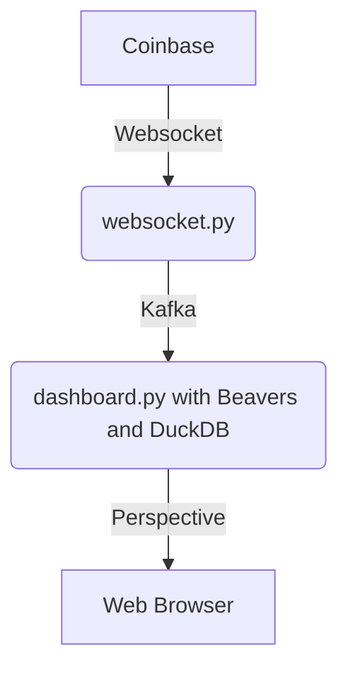

# Coinbase Market Data API Duckdb

This example shows how you can leverage 3 powerful python libraries, [Beavers](https://github.com/tradewelltech/beavers) and [Perspective](https://github.com/finos/perspective) and [DuckDB](https://duckdb.org/), to create a tool to query data in real time.
This tutorial assumes you are familiar with Kafka and Python and Apache Arrow.

## Architecture Overview

We will connect to Coinbase's websocket API to receive crypto market price and status update in real time.
In order to share this data with other services and decouple producers from consumers, we'll publish this data over [Kafka](https://kafka.apache.org/), as json.
We'll then run a [Beavers](https://github.com/tradewelltech/beavers) job that will read the data from Kafka, and expose it to duckdb.
The data can then be queried from a web browser and rendered using Perspective.


  
## Initial Set Up

You'll need:

- Git
- Python (at least 3.10)
- Docker to run a Kafka cluster

The code for this tutorial is available on [github](https://github.com/0x26res/beavers-examples/tree/master/01_coinbase_analytics)

### Clone the repo

```shell
git clone https://github.com/0x26res/beavers-examples
cd beavers-example/01_coinbase_analytics/
```

### Set Up the Virtual Environment

```shell
python3 -m venv --clear .venv
source ./.venv/bin/activate
pip install -r requirements.txt
```

### Set Up Kafka

We use the [kafka-kraft](https://github.com/bashj79/kafka-kraft-docker) docker image to run a super simple Kafka cluster.
To start the cluster:

```shell
docker run --name=simple_kafka -p 9092:9092 -d bashj79/kafka-kraft
```

Once started you can create 2 Kafka topics called `ticker` and `status`

```shell
docker exec simple_kafka /opt/kafka/bin/kafka-topics.sh --create --topic=ticker --partitions=1 --bootstrap-server=localhost:9092 --replication-factor=1
docker exec simple_kafka /opt/kafka/bin/kafka-topics.sh --create --topic=status --partitions=1 --bootstrap-server=localhost:9092 --replication-factor=1
```

### Publish Coinbase's Market Data on Kafka

In this step, we'll run a simple python job that listen to Coinbase's Websocket market data API, and publish the data on the `ticker` Kafka topic.

```shell
python ./websocket_feed.py
```

You should now be able to see the Coinbase data streaming on Kafka.

```shell
docker exec simple_kafka /opt/kafka/bin/kafka-console-consumer.sh \
  --topic=ticker \
  --bootstrap-server=localhost:9092
```

### Run the DuckDB server

```shell
python ./duckdb_server.py
```

You can see the query console in http://localhost:8082/.


