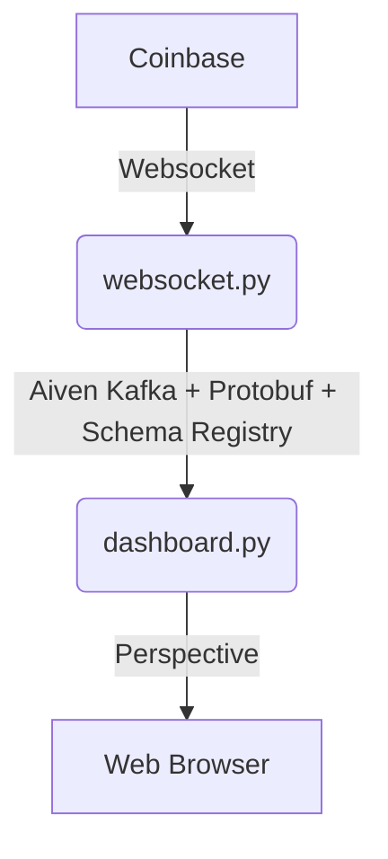

# Beavers & Aiven

This example shows how you can use [Beavers](https://github.com/tradewelltech/beavers)
with [Aiven](https://aiven.io/) kafka free tier account, and their schema registry with Protobuf.


## Architecture Overview

We will connect to Coinbase's websocket API to receive crypto market price and status update in real time.
In order to share this data with other services and decouple producers from consumers, we'll publish this data
over [Kafka](https://kafka.apache.org/) to aiven.
It will use protobuf, and the schema registry provided by Aiven.
We'll then run a [Beavers](https://github.com/tradewelltech/beavers) job that will read the data from aiven, and show it in a basic UI.



## Initial Set Up

You'll need:

- Git
- Python (at least 3.10)
- [uv](https://docs.astral.sh/uv/)
- An Aiven free tier account.

The code for this tutorial is available
on [github](https://github.com/0x26res/beavers-examples/tree/master/03_aiven)

### Clone the repo

```shell
git clone https://github.com/0x26res/beavers-examples
cd beavers-examples/03_aiven/
```

### Install Dependencies / Build Protos

```shell
uv sync
```

### Set Up Aiven Kafka And Postgres

We use aiven for kafka and postgress. You need to create and account and create:

- a free tier kafka project
- a free tier postgres project

Then we'll save the secrets and config in [.secrets](/.secrets) and in your rc file.

```shell
export PROJECT_NAME=
export KAFKA_SERVICE_NAME=
export POSTGRES_SERVICE_NAME=

avn user login --token
mkdir -p .secrets
avn service user-creds-download --target-directory=.secrets --username avnadmin $KAFKA_SERVICE_NAME
avn service get $KAFKA_SERVICE_NAME --project=$PROJECT_NAME --json > .secrets/kafka.json
```

Then extract the environment variables and add them to your `.zshrc`:

```shell
jq -r '"export KAFKA_BOOTSTRAP_SERVERS=\"" + .service_uri + "\""' .secrets/kafka.json
jq -r '"export SCHEMA_REGISTRY_URI=\"" + .connection_info.schema_registry_uri + "\""' .secrets/kafka.json
echo "export POSTGRES_URI=$(avn service get $POSTGRES_SERVICE_NAME --format '{service_uri}')"
```

Also, you need to create topics `ticker` and `status`:

```shell
avn service topic-create $KAFKA_SERVICE_NAME ticker --partitions=1 --replication=2
avn service topic-create $KAFKA_SERVICE_NAME status --partitions=1 --replication=2
```

### Publish Coinbase's Market Data on Kafka

In this step, we'll run a simple python job that listen to Coinbase's Websocket market data API, and publish the data on
the `ticker` and `status` Kafka topic.

```shell
uv run websocket-feed
```

You should now be able to see the Coinbase data streaming on Kafka in the Aiven console.

### Run the Dashboard

The dashboard consumes the data from aiven kafka and displays it in realtime.

```shell
uv run dashboard
```

You can see the dashboard in http://localhost:8082/ticker.
