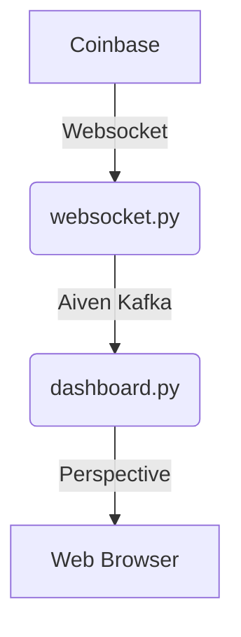

# Beavers & Aiven

This example shows how you can use beavers with Aiven kafka free tier account.

## Architecture Overview

We will connect to Coinbase's websocket API to receive crypto market price and status update in real time.
In order to share this data with other services and decouple producers from consumers, we'll publish this data
over [Kafka](https://kafka.apache.org/) to aiven.
It will use protobuf, and the schema registry provided by Aiven.
We'll then run a [Beavers](https://github.com/tradewelltech/beavers) job that will read the data from aiven, and show it in a basic UI.



## Initial Set Up

You'll need:

- Git
- Python (at least 3.10)
- An Aiven free tier account.

The code for this tutorial is available
on [github](https://github.com/0x26res/beavers-examples/tree/master/03_aiven)

### Clone the repo

```shell
git clone https://github.com/0x26res/beavers-examples
cd beavers-example/01_coinbase_analytics/
```

### Set Up the Virtual Environment

```shell
uv venv --clear
source ./.venv/bin/activate
uv pip install -r requirements.txt
```

### Generate Protos Python Code

```shell
python ./protoc.py
```

### Set Up Kafka

We use aiven for kafka. You need to create and account, and set up the secret keys:

```shell
export KAFKA_BOOTSTRAP_SERVERS="xxx"
mkdir -p .secrets
touch .secrets/ca.pem .secrets/service.cert .secrets/service.key # fill from the values in 
```

Also, you need to:
- create topics `ticker` and `status` in their UI.
- find the schema registry URL with username and password and put it in `$SCHEMA_REGISTRY_URI`.

### Publish Coinbase's Market Data on Kafka

In this step, we'll run a simple python job that listen to Coinbase's Websocket market data API, and publish the data on
the `ticker` and `status` Kafka topic.

```shell
python ./websocket_feed.py
```

You should now be able to see the Coinbase data streaming on Kafka.

```shell
docker exec simple_kafka /opt/kafka/bin/kafka-console-consumer.sh \
  --topic=ticker \
  --bootstrap-server=localhost:9092
```

### Run the DuckDB server

```shell
python ./duckdb_server.py
```

You can see the query console in http://localhost:8082/.


